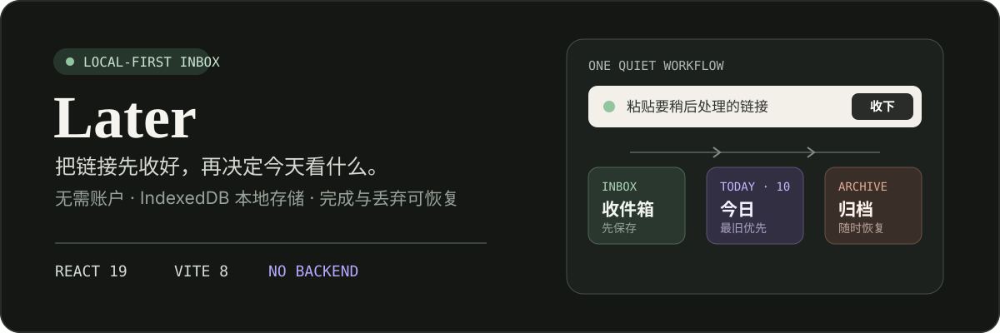
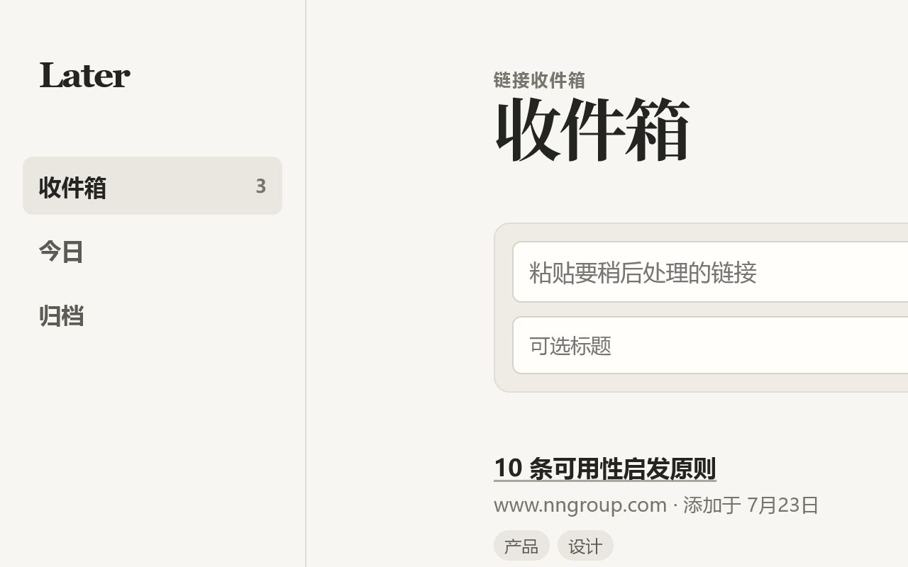
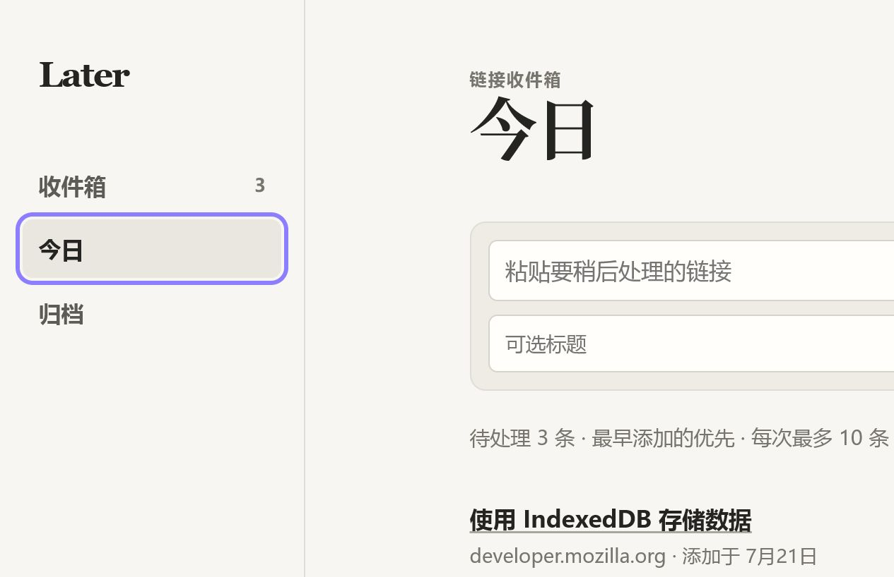

<p align="center">
  
</p>

<h1 align="center">Later</h1>

<p align="center">
  一个克制的“稍后处理”链接收件箱。<br>
  先收下临时链接，再从最早积压的内容开始处理。
</p>

<p align="center">
  <a href="https://hkm-a.github.io/later/"></a>
  <a href="https://github.com/hkm-a/later/actions/workflows/deploy-pages.yml"></a>
  <a href="src/lib/storage.ts"></a>
  <a href="package.json"></a>
</p>

<p align="center">
  <a href="https://hkm-a.github.io/later/"><strong>打开 Later</strong></a>
  ·
  <a href="DEVLOG.md">阅读开发日志</a>
</p>

> 数据只保存在当前浏览器。Later 没有账户、后端或同步服务；清除该站点的浏览器数据也会清除已保存链接。

<table>
  <tr>
    <td width="50%"></td>
    <td width="50%"></td>
  </tr>
  <tr>
    <td align="center">收件箱：先保存，按最新添加浏览</td>
    <td align="center">今日：最多 10 条，最早添加优先</td>
  </tr>
</table>

## 工作方式

| 阶段 | 作用 | 排序与操作 |
| --- | --- | --- |
| 收件箱 | 承接暂时无暇查看的链接 | 最新添加在前；可以打开、完成或丢弃 |
| 今日 | 把积压变成有限的处理队列 | 最早添加在前；每次最多显示 10 条 |
| 归档 | 保存处理结果，避免误操作丢失 | 按完成/丢弃筛选，也可以恢复到收件箱 |

```text
粘贴链接 -> 收件箱 -> 今日队列 -> 完成 / 丢弃 -> 归档 -> 恢复
```

## 已有能力

- 粘贴网址时自动补全 `https://`，仅接受 HTTP(S) 链接。
- 可选填写标题和逗号分隔标签；标签自动去重并转为小写。
- 在当前视图中搜索标题、网址和标签，按 `/` 可直接聚焦搜索框。
- 写入 IndexedDB 成功后才更新界面，避免“看似保存、实际丢失”。
- 丢弃不等于删除，归档中的记录可以恢复。
- 桌面侧栏会在窄屏切换为移动端顶栏。

## 本地运行

需要 Node.js 20.19+（或 22.12+）及 npm。

```bash
git clone https://github.com/hkm-a/later.git
cd later
npm ci
npm run dev
```

开发服务器启动后打开终端输出的本地地址。执行完整 TypeScript 检查与生产构建：

```bash
npm run check
```

## 项目结构

```text
src/
├── App.tsx                 # 视图、搜索与持久化集合
├── components/             # 新增表单与链接列表
├── lib/links.ts            # URL、标签与搜索规则
├── lib/storage.ts          # IndexedDB 读写
├── lib/demo.ts             # 首次使用的演示数据
└── styles.css              # 桌面与移动端布局
```

实现取舍、数据流和浏览器验收记录见 [DEVLOG.md](DEVLOG.md)。

## 数据边界

Later 只持久化一种记录：

```ts
type LinkItem = {
  id: string
  url: string
  title: string
  tags: string[]
  status: 'inbox' | 'done' | 'discarded'
  createdAt: string
  updatedAt: string
}
```

首次打开空数据库时会加入 5 条演示记录。“重置演示数据”会在确认后替换当前浏览器中的全部 Later 数据。

## 产品边界

以下能力目前有意不纳入项目：

- 账户、跨设备同步和后端
- 浏览器扩展与书签导入
- AI 标签、推荐与网页内容抓取
- 团队协作、分享与原生移动端应用

在真实需求出现前，它们都应视为独立产品，而不是默认进入 Later。

## 许可证

仓库当前未声明许可证。在许可证文件加入前，请不要假设代码和资源已获得开源再分发授权。
